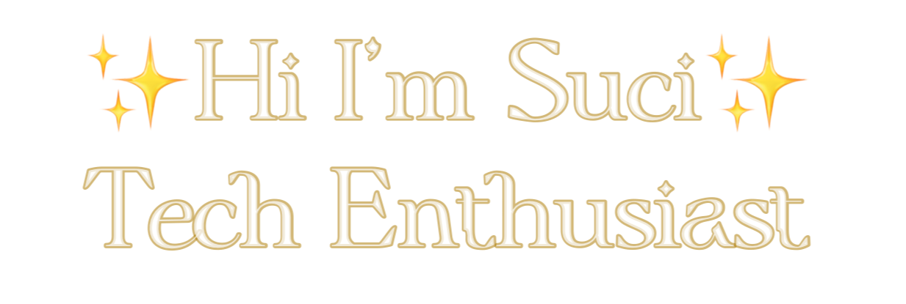

  
<!--    
   -->

## About Me

IT Professional with over 4 years of experience in designing, developing, testing, maintaining, debugging software for several industries. At my previous job as Fullstack Engineer, I put my responsibility to assure the system could be released properly and the company could deliver a high-quality system. Currently interested in and focused on learning Manual Testing and Automation Testing and **open for job opportunity as Quality Engineer**. Constantly motivated to learn, grow, and excel in Technology.

## 📈Stats

  
  
  

## 🔨Languages and Tools

## 🔗Connect

    

<!--
**sucinm/sucinm** is a ✨ _special_ ✨ repository because its `README.md` (this file) appears on your GitHub profile.

Here are some ideas to get you started:

- 🔭 I’m currently working on ...
- 🌱 I’m currently learning ...
- 👯 I’m looking to collaborate on ...
- 🤔 I’m looking for help with ...
- 💬 Ask me about ...
- 📫 How to reach me: ...
- 😄 Pronouns: ...
- ⚡ Fun fact: ...
-->
